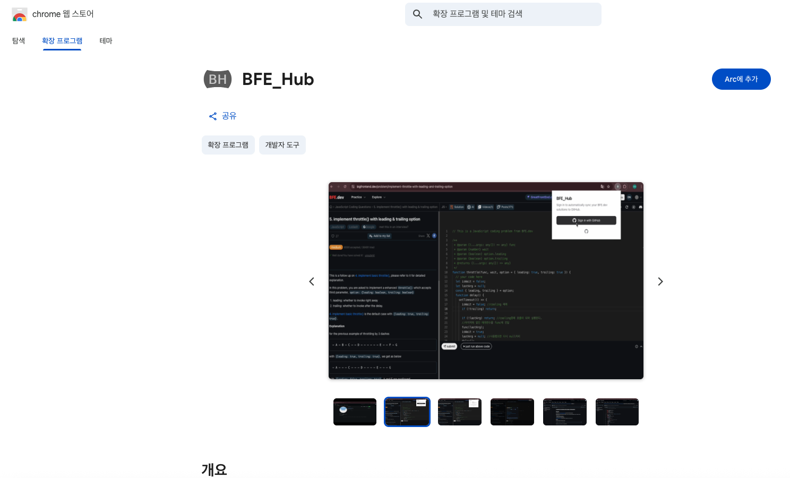

# BFE_Hub

  
  <h1>BFE_Hub</h1>
  
BFE.dev 솔루션을 GitHub에 자동으로 동기화하세요.

  
  
  
   
  <a href="README.md">🇺🇸 English</a> | <b>🇰🇷 한국어</b>

## 목차

1. [Chrome 웹 스토어](#chrome-웹-스토어에서-다운로드)
2. [BFE_Hub란?](#bfe_hub란)
3. [설치 및 설정](#설치-및-설정)
4. [작동 원리](#작동-원리)
    1. [워크플로우](#1-워크플로우)
    2. [업로드 시점](#2-업로드-시점)
    3. [저장되는 정보](#3-저장되는-정보)
5. [링크 및 지원](#링크-및-지원)

 

## Chrome 웹 스토어에서 다운로드

아래 링크를 클릭하여 Chrome 웹 스토어에서 바로 BFE_Hub를 설치하세요!
 
 

👉

 

 
 

## BFE_Hub란?

**BFE_Hub**는 [BFE.dev](https://bigfrontend.dev)에서 푼 문제 코드를 GitHub 리포지토리에 자동으로 동기화해주는 크롬 확장 프로그램입니다. 프론트엔드 인터뷰를 준비하면서 자연스럽게 나만의 포트폴리오를 만들어보세요.

(이 프로젝트는 BaekjoonHub, LeetHub와 같은 도구에서 영감을 받아 제작되었습니다.)

## 🎥 시연 영상

 

## 설치 및 설정

1.  [Chrome 웹 스토어](https://chrome.google.com/webstore/detail/ajmpkjfgallagdphodjnmddomgaleahn)에서 확장 프로그램을 설치합니다.
2.  확장 프로그램 아이콘을 클릭하고 **"Sign in with GitHub"** 버튼을 누릅니다.
3.  GitHub 계정 연동을 승인(Authorize)합니다.
4.  리디렉션 후 확장 프로그램 아이콘을 다시 클릭하여 연결 상태를 확인합니다.
5.  **리포지토리 설정**: 솔루션을 저장할 리포지토리 이름을 입력하라는 창이 뜹니다. (예: `bfe-solutions`). 원하는 이름을 입력하고 **"Save"**를 클릭하세요.
    *   해당 리포지토리가 없으면 BFE_Hub가 자동으로 생성해 줍니다.

 

## 작동 원리

### 1. 워크플로우

1.  [BFE.dev](https://bigfrontend.dev)에서 문제를 풉니다.
2.  **Submit** 버튼을 클릭합니다.
3.  모든 테스트 케이스를 통과하면, BFE_Hub가 자동으로 다음 작업을 수행합니다:
    *   문제 설명과 작성한 정답 코드를 가져옵니다.
    *   연동된 GitHub 리포지토리에 커밋(업로드)합니다.
4.  BFE.dev의 성공 모달창에 초록색 체크 표시(✅)가 뜨면 동기화 완료입니다.

### 2. 업로드 시점

BFE_Hub는 **"Submit" 버튼을 누르고 정답을 맞혔을 때(Pass)**만 작동합니다. 실패한 시도나 테스트 케이스 통과 실패 시에는 업로드되지 않습니다.

### 3. 저장되는 정보

문제를 해결하면 다음과 같은 정보가 리포지토리에 저장됩니다:

| 플랫폼 | 문제 메타데이터 | 사용자 제출 정보 |
| :--- | :--- | :--- |
| **BFE.dev** | - **카테고리** (예: JavaScript, React) - **문제 제목** - **문제 링크** - **문제 설명** (README.md 파일) | - **풀이 코드** (.js / .tsx) - **README.md** |

 

## 링크 및 지원

<table>
  <tr>
    <td align="center">
       <b>버그 신고</b>
    </td>
    <td align="center">
       <b>GitHub Repo</b>
    </td>
     <td align="center">
       <b>후원하기</b>
    </td>
  </tr>
</table>

### ☕ Buy me a coffee

이 도구가 도움이 되셨다면 커피 한 잔 후원해 주세요! 큰 힘이 됩니다. 😊

 

## 📝 라이센스

이 프로젝트는 오픈 소스이며 [MIT License](LICENSE) 하에 배포됩니다.

---

  Built with ❤️ for the BFE.dev community

